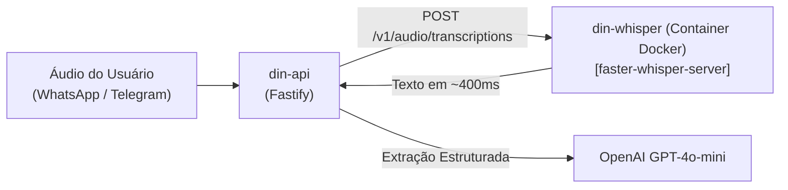

# 🚀 Meu Dino — Planejamento de Melhorias Futuras & Estratégia de Escala

Este documento consolida o planejamento técnico, otimizações de Inteligência Artificial, infraestrutura e projeções de negócio para a evolução do **Meu Dino**.

---

## 🎙️ 1. Otimização de Processamento de Áudio & IA

### 1.1. Cenário Atual
- **Transcrição de Áudio:** OpenAI Whisper (`whisper-1`) cobrado por minuto (~$0.006/min ≈ R$ 0,034/min).
- **Consumo Médio:** Áudios financeiros curtos (3 a 6 segundos) custam ~R$ 0,0028 por áudio.
- **Interpretação Financeira:** OpenAI `gpt-4o-mini` (~R$ 0,0008 por mensagem).
- **Custo Combinado:** ~R$ 0,0036 por áudio processado.

---

### 1.2. Opção A: Transcrição Instantânea via Groq Cloud API
- **Modelo:** `whisper-large-v3-turbo` hospedado em LPUs (Language Processing Units).
- **Vantagens:**
  - Velocidade quase instantânea (~100ms a 200ms de latência).
  - Custo 10x mais barato que a OpenAI ($0.00004 por segundo de áudio).
  - 0% de consumo de CPU e RAM na VPS do Meu Dino.
  - API 100% compatível com a biblioteca oficial da OpenAI.

---

### 1.3. Opção B: Container Whisper Local (Self-Hosted no Docker)
Permite zerar o custo de API de áudio executando a transcrição diretamente na VPS onde o Meu Dino está hospedado.



#### Tabela Comparativa de Recursos por Modelo (`faster-whisper` com quantização `int8`):

| Modelo | RAM em Repouso | RAM em Pico | Tamanho em Disco | Tempo em CPU (áudio 5s) | Precisão PT-BR |
| :--- | :---: | :---: | :---: | :---: | :--- |
| **`tiny`** | ~80 MB | ~150 MB | ~75 MB | ~0.15 s | Básica |
| **`base` (Recomendado)** | **~150 MB** | **~350 MB** | **~140 MB** | **~0.40 s** | **Excelente para comandos financeiros** |
| **`small`** | ~400 MB | ~900 MB | ~480 MB | ~1.20 s | Altíssima precisão |

#### Exemplo de Configuração no `docker-compose.yml`:
```yaml
  whisper:
    image: fedirz/faster-whisper-server:latest-cpu
    container_name: din-whisper
    restart: unless-stopped
    environment:
      - WHISPER_MODEL=base
      - WHISPER_LANGUAGE=pt
      - WHISPER_DEVICE=cpu
      - WHISPER_COMPUTE_TYPE=int8
    ports:
      - "8000:8000"
    networks:
      - din-network
```

---

## 📈 2. Projeção Financeira & Modelo de Negócio (Freemium Híbrido)

### 2.1. Estrutura de Planos
* **Plano Grátis:** Acesso com limites saudáveis de mensagens + **Banners de anúncios não invasivos** no painel web (AdSense / Programática).
* **Plano PRO Único:** **R$ 19,90 / mês** (ou R$ 197 / ano) — Mensagens e áudios ilimitados no WhatsApp/Telegram, alertas de vencimento, múltiplas contas, orçamentos e painel 100% sem anúncios.

> **Conversão Estimada:** **4% a 7%** da base total de usuários migram para o Plano PRO.

### 2.2. Cenários de Escala e Faturamento

| Base Total de Usuários | Usuários Grátis (Banners) | Assinantes PRO (5% Conv.) | Receita Mensal Total | Custos Estimados | Lucro Líquido Mensal |
| :---: | :---: | :---: | :---: | :---: | :---: |
| **1.000 usuários** | 950 (~R$ 120/mês) | 50 (R$ 995/mês) | **R$ 1.115 / mês** | ~R$ 180 / mês | **~R$ 935 / mês** |
| **5.000 usuários** | 4.750 (~R$ 600/mês) | 250 (R$ 4.975/mês) | **R$ 5.575 / mês** | ~R$ 650 / mês | **~R$ 4.925 / mês** |
| **20.000 usuários** | 19.000 (~R$ 2.400/mês) | 1.000 (R$ 19.900/mês) | **R$ 22.300 / mês** | ~R$ 2.100 / mês | **~R$ 20.200 / mês** |
| **100.000 usuários** | 95.000 (~R$ 12.000/mês) | 5.000 (R$ 99.500/mês) | **R$ 111.500 / mês** | ~R$ 9.800 / mês | **~R$ 101.700 / mês** |

---

## 💡 3. Funcionalidades Planejadas para Próximas Versões

1. **Visão Computacional para Comprovantes e Notas Fiscais (OCR via GPT-4o Vision):**
   - Permitir que o usuário fotografe um cupom de supermercado ou comprovante PIX no WhatsApp/Telegram e o Meu Dino extraia valor, itens e forma de pagamento automaticamente.
2. **Relatórios Semanais Proativos em PDF no WhatsApp:**
   - Todo domingo à noite ou segunda pela manhã, envio automático de um resumo financeiro da semana com gráficos e saldo consolidado.
3. **Alertas Inteligentes de Teto de Gastos (Budgets):**
   - Avisar o usuário quando atingir 80% e 100% do limite estipulado para categorias como *Alimentação*, *Lazer* ou *Transporte*.
4. **Módulo de Cobrança PIX Automática para MEIs:**
   - Gerar cobrança com QR Code Copia e Cola via WhatsApp para clientes de autônomos com baixa automática após compensação.
